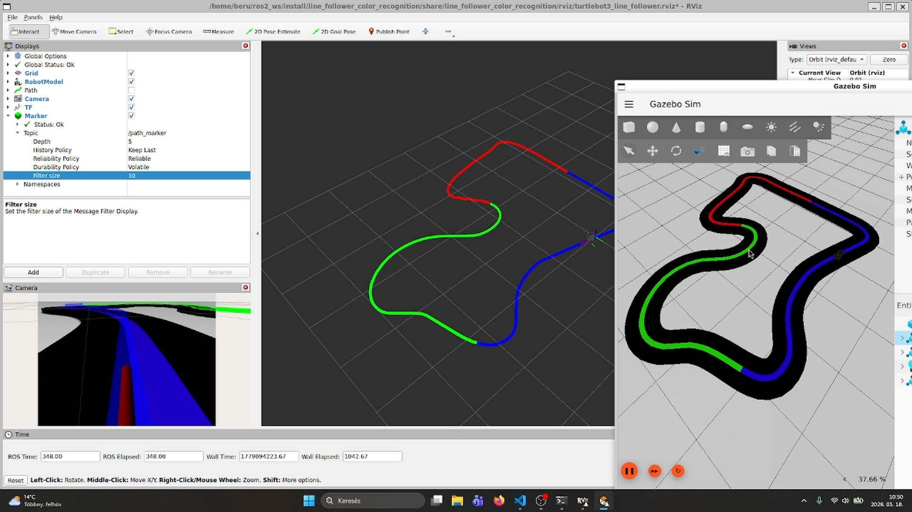

[//]: # (Image References)

[image1]: ./assets/turtlebot3_burger.png "Robotmodell"
[image2]: ./assets/track_dark.png "Pálya sötét alapon"
[image3]: ./assets/track_light.png "Pálya világos alapon"
[image4]: ./assets/model_training.png "Tanítási eredmények"
[image5]: ./assets/path_visualizer.png "Vizualizációs node"

# ROS 2 projekt a Kognitív robotika tárgyra (BMEGEMINMKR)

A feladat a Budapesti Műszaki és Gazdaságtudományi Egyetem mechatronikai mérnöki MSc képzés Kognitív robotika (BMEGEMINMKR) tantárgyához készült.

Készítette:
- Docsa Bence
- Horváth Ákos
- Kincses Tamás Leó
- Nagy Bertalan

# Tartalomjegyzék

- [Feladatleírás](#feladatleírás)
- [Előkövetelmények](#előkövetelmények)
- [TurtleBot3](#turtlebot3)
- [Pálya](#pálya)
- [Neurális hálózat](#neurális-hálózat)
- [Vizualizációs node](#vizualizációs-node)
- [Bemutató](#bemutató)

# Feladatleírás

A projekt megvalósítása során a következő követelményeket kellett teljesíteni:
- Vonalkövetés és színfelismerés neurális hálóval
- Saját vizualizációs node-ban megmutatni a robot által bejárt utat és a vonal színét az út során
- A robot viselkedjen eltérően a különböző színű vonalak esetén

# Előkövetelmények

- Ubuntu 24.04
    - A projekt elkészítése során WSL 2 segítségével használtuk
- [ROS 2 Jazzy](https://docs.ros.org/en/jazzy/index.html)
    - [Telepítési útmutató](https://docs.ros.org/en/jazzy/Installation/Ubuntu-Install-Debs.html)
        - A Desktop Install-t javasoljuk, mert az tartalmazza az RViz-t is
- [RViz](https://docs.ros.org/en/jazzy/Tutorials/Intermediate/RViz/RViz-Main.html)
- [Gazebo Harmonic](https://gazebosim.org/docs/harmonic/getstarted/)
    - [Telepítési útmutató](https://gazebosim.org/docs/harmonic/install_ubuntu/)
    - Szükséges a [Gazebo ROS integráció](https://docs.ros.org/en/jazzy/p/ros_gz/) telepítése:
        ```bash
        sudo apt install ros-jazzy-ros-gz
        ```
- URDF fájlok megnyitásához:
    ```bash
    sudo apt install ros-jazzy-urdf
    sudo apt install ros-jazzy-urdf-launch
    ```
- A projekt során [TurtleBot3](https://emanual.robotis.com/docs/en/platform/turtlebot3/overview/)-at használunk `burger` konfigurációban
    - Az alábbi csomagok segítségével biztosított a kompatibilitás:
        ```bash
        git clone -b ros2 https://github.com/MOGI-ROS/turtlebot3_msgs
        git clone -b mogi-ros2 https://github.com/MOGI-ROS/turtlebot3
        git clone -b new_gazebo https://github.com/MOGI-ROS/turtlebot3_simulations
        ```
- [Dynamixel SDK](https://emanual.robotis.com/docs/en/software/dynamixel/dynamixel_sdk/overview/)
    ```bash
    sudo apt install ros-dynamixel-sdk
    ```
    vagy
    ```bash
    git clone -b humble-devel https://github.com/MOGI-ROS/DynamixelSDK/
    ```
- [MOGI Trajectory Server](https://github.com/MOGI-ROS/mogi_trajectory_server)
    ```bash
    git clone https://github.com/MOGI-ROS/mogi_trajectory_server
    ```
- Python csomagok:
    - `tensorflow==2.18.0`
    - `keras==3.7.0`
    - `imutils`
    - `scikit-learn`
    - `opencv-python==4.11.0.86`
    - `matplotlib`
    - `numpy==1.26.4`

# TurtleBot3

A `burger` konfigurációjú TurtleBot3-at a [turtlebot3_burger.urdf](./line_follower_color_recognition/urdf/turtlebot3_burger.urdf) fájl írja le, szimulációs működését a [turtlebot3_burger/model.sdf](./line_follower_color_recognition/models/turtlebot3_burger/model.sdf) fájl tartalmazza.

A robotmodell megtekinthető RViz-ben a [check_urdf.launch.py](./line_follower_color_recognition/launch/check_urdf.launch.py) launch fájl segítségével:
```bash
ros2 launch line_follower_color_recognition check_urdf.launch.py
```

![alt text][image1]

# Pálya

A projekt során használt pálya egy színes vonalat tartalmaz sötét vagy világos alapon. A vonal három szakaszból áll: piros, zöld és kék. A modellek a [gazebo_models](./line_follower_color_recognition/gazebo_models/) mappában találhatóak.

A pálya megtekinthető és a robottal bejárható a [spawn_robot.launch.py](./line_follower_color_recognition/launch/spawn_robot.launch.py) launch fájl segítségével.

Pálya sötét alapon:
```bash
ros2 launch line_follower_color_recognition spawn_robot.launch.py world:=track_dark.sdf
```

![alt text][image2]

Pálya világos alapon:
```bash
ros2 launch line_follower_color_recognition spawn_robot.launch.py world:=track_light.sdf
```

![alt text][image3]

A neurális háló tanításához szükséges képeket a [save_training_images](./line_follower_color_recognition_py/line_follower_color_recognition_py/save_training_images.py) node segítségével lehet elkészíteni a [saved_images](./line_follower_color_recognition_py/saved_images/) mappába:
```bash
ros2 run line_follower_color_recognition_py save_training_images
```

Ehhez segítségül használható a [line_follower](./line_follower_color_recognition_py/line_follower_color_recognition_py/line_follower.py) node, ami képfeldolgozás segítségével automatikusan végigvezeti a robotot a pályán:
```bash
ros2 run line_follower_color_recognition_py line_follower
```

A robot manuálisan is irányítható:
```bash
ros2 run teleop_twist_keyboard teleop_twist_keyboard
```

# Neurális hálózat

A projekt során készített kétkimenetű konvolúciós neurális hálózat (CNN) két klasszifikációt végez el a roboton lévő kamera képe alapján:
- Meghatározza, hogy a robotnak mit kell tennie a vonal követése érdekében: előremenni, jobbra fordulni, balra fordulni.
- Meghatározza, hogy a robot által követett vonal aktuális szakasza milyen színű: piros, kék, zöld.

A hálózat tanítása a [train_network.py](./line_follower_color_recognition_py/line_follower_color_recognition_py/train_network.py) Python kód segítségével történik.
```bash
python train_network.py
```

A tanításhoz használt képek a [training_images](./line_follower_color_recognition_py/training_images/) mappában találhatóak felcímkézve. Ezek a képek a [track_dark](./line_follower_color_recognition/worlds/track_dark.sdf) és a [track_light](./line_follower_color_recognition/worlds/track_light.sdf) bejárása során készültek.

A modell tanítása kihagyható, mert a [network_model](./line_follower_color_recognition_py/network_model/) mappában megtalálható a tanított modell.

![alt text][image4]

A neurális háló használható vonalkövetésre a [line_follower_cnn](./line_follower_color_recognition_py/line_follower_color_recognition_py/line_follower_cnn.py) node segítségével:
```bash
ros2 run line_follower_color_recognition_py line_follower_cnn
```
A node használata során a robot a különböző színű vonalszakaszokon eltérő sebességgel megy végig. Ez a sebességkülönbség nem számottevő, csupán a különböző színek érzékeltetésére szolgál.
| Szín  | Sebességszorzó |
| :---: | :------------: |
| piros | 1              |
| zöld  | 0,9            |
| kék   | 1,1            |

# Vizualizációs node

A robot által megtett utat és a követett vonal színét a [path_visualizer](./line_follower_color_recognition_py/line_follower_color_recognition_py/path_visualizer.py) node segítségével lehet kirajzoltatni RVizben.
```bash
ros2 run line_follower_color_recognition_py path_visualizer
```

![alt text][image5]

# Bemutató

A teljes szimuláció egyben elindítható a [simulation.launch.py](./line_follower_color_recognition/launch/simulation.launch.py) launch fájl használatával:
```bash
ros2 launch line_follower_color_recognition simulation.launch.py
```

A vonalkövető robot működés közben megtekinthető az alábbi képre kattintva:

<a href="https://youtu.be/I9mQb31-4-M"></a>